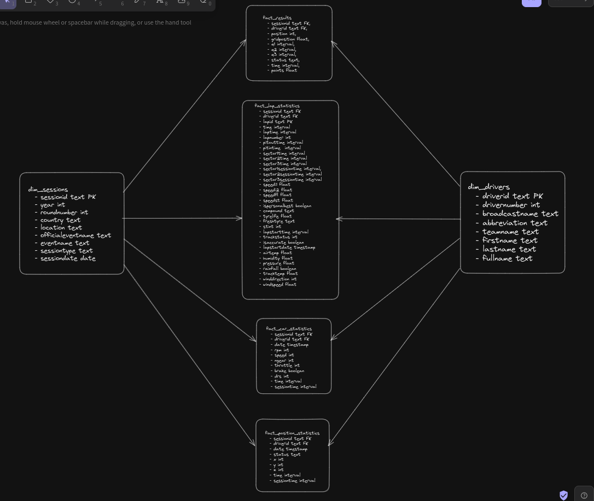

# fastf1-project

## Project flow
- When running the containers initially, the database is created through the postgres entrypoint. This [file](./airflow/pg_init_scripts/multiple_db.sh) runs before any container starts running
- When the dag is initialised, it's sole job is run this python [file](./extract/fastf1_extract.py) rom 2019 till 2022
- The python gets the event schedule for each year and structures it according to the database schema
- For each session, the results and lap statistics are gotten and also sent to the database

## Database Structure
- Fastf1 library data is sent to the database following the star schema
    
- The database contains 2 dimension tables: `dim_sessions` and `dim_drivers` that contain information about sessions and drivers
- There are 2 main fact tables: `fact_results` and `fact_lap_statistics` which contain race results and drivers lap statistics respectively
- One of the fact table `fact_lap_statistics` is further normalised into another table: `fact_lap_telemetry_statistics` which contain telemetry information for each lap.
- I should note here that in an ideal star schema, there should be only one fact table, but due to the complexity of the data, normalising the facts of the data made it easier to reasn about.

## Recreating the project
- Go to the airflow directory
    ```
    cd airflow/
    ```
- You have run airflow before so run these commands first to start afresh
    ```
    docker-compose down
    docker volume rm airflow_postgres-db-volume
    rm -r logs
    ```
- Run these commands
    ```
    echo -e "AIRFLOW_UID=$(id -u)" > .env
    mkdir logs/
    mkdir ../fastf1_cache/
    docker-compose build
    docker-compose up airflow-init
    docker-compose up -d
    ```
- Check periodically through `docker ps` whether the webserver is healthy
- Once it is, go to `localhost:8080` on your webbrowser. Use `airflow` as username and password
- Trigger the DAG on the airflow UI
- To check results on the database as the dag is running, use `psql` or any postgres client you have to log in to postgres. The database is available on port `5432`. The username is `airflow` and the database name is `fastf1`
    ```
    psql -h localhost -p 5434 -U airflow -d fastf1
    ```
- If you can't access data from the terminal, go into the docker container and access postgres there
    ```
    docker exec -it <container_id> bash

    psql -U airflow -d fastf1
    ```
- You can run these queries on the database after year 2019 has finished running on the Airflow UI to test that data entered and everything is working pefectly
    ```sql
    select * from dim_sessions;
    select * from dim_drivers;
    select * from fact_results;
    select * from fact_lap_statistics;
    select * from fact_lap_telemetry_statistics;
    ```
- For a rerun of years that stop unexpectedly:
    - Log in into docker on the shell
    ```
    docker exec -it <container_id> bash
    ```
    - For 2019,
    ```
    airflow dags backfill -s 2019-01-01 -e 2019-12-31 --reset-dagruns fastf1_extract
    ```
    - For 2020,
    ```
    airflow dags backfill -s 2020-01-01 -e 2020-12-31 --reset-dagruns fastf1_extract
    ``` 
    - For 2021,
    ```
    airflow dags backfill -s 2021-01-01 -e 2021-12-31 --reset-dagruns fastf1_extract
    ```
    - For 2022,
    ```
    airflow dags backfill -s 2022-01-01 -e 2022-12-31 --reset-0dagruns fastf1_extract
    ```
    - It has already been set to not repeat what has been run before